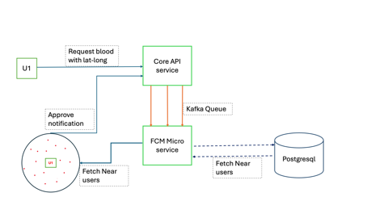
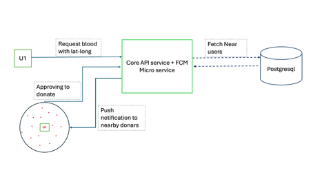

# Blood Finder 🩸

Hi All, Thanks for reaching here. Here You can see my project blood donation. I am giving a basic overview of this project here. If you are really interested to know more please feel free to connect with me personally.  

## Vision
This application aims to help people finding blood in emergency situations. Our application find donors by sending push notifications to users residing nearby.

## Overview

- Request Blood 
- Send instant notification to nearby users (Push notification and Email)
- Allowing multiple donors to accept a blood request.  
- Connecting blood receivers and donors.

## Current state
- This application has main components
1. API service
   1. API building is almost done.
   2. Completed Request blood, accept request and sending notification methods.
   3. User registration and authentication - yet to start 
2. Apk for user interaction 
   1. Yet to start
   

## Contributions
I am actively working on this to take into live soon. If you are really interested in contributing, please contact me !

## 📬 Contact Me

- [LinkedIn](https://www.linkedin.com/in/abhinay-reddy-bellamkonda-927553191)
- Email: **abhinayreddyb.309@gmail.com**

